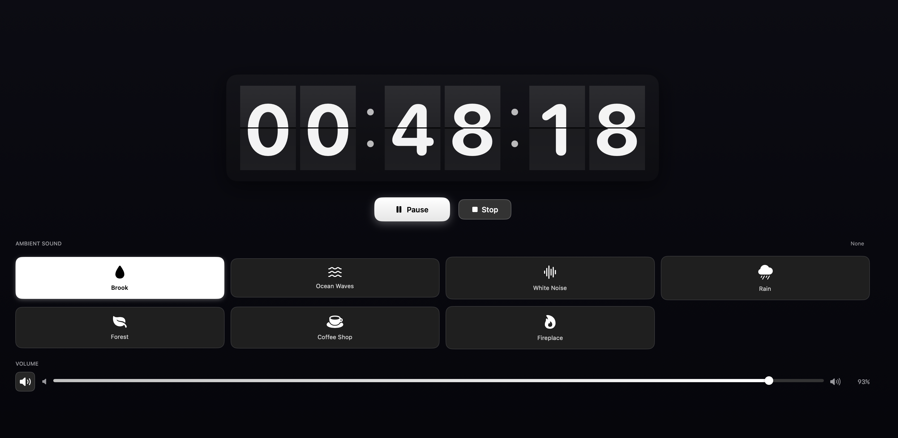

# FlowTimer

A beautiful macOS focus timer app with ambient sounds to help you get into flow state.

## Features

- **Flip Clock Display** - Beautiful animated flip clock showing hours, minutes, and seconds
- **Duration Presets** - Quick selection of 30min, 1hr, 2hr, 3hr, or 4hr focus sessions
- **Ambient Sounds** - 7 built-in ambient sounds to enhance focus:
  - Brook
  - Ocean Waves
  - White Noise
  - Rain
  - Forest
  - Coffee Shop
  - Fireplace
- **Volume Control** - Adjustable volume with mute toggle
- **Session History** - Track your completed focus sessions
- **Dark Theme** - Easy on the eyes for extended focus sessions
- **Compact Mode** - Minimize the window while staying focused

## Requirements

- macOS 14.0+
- Xcode 15.0+

## Installation

1. Clone the repository
2. Open `FlowTimer.xcodeproj` in Xcode
3. Build and run (⌘+R)

## Usage

1. Select your desired focus duration
2. Choose an ambient sound (optional)
3. Click "Start Flow" to begin
4. Stay focused until the timer completes

## License

MIT License
